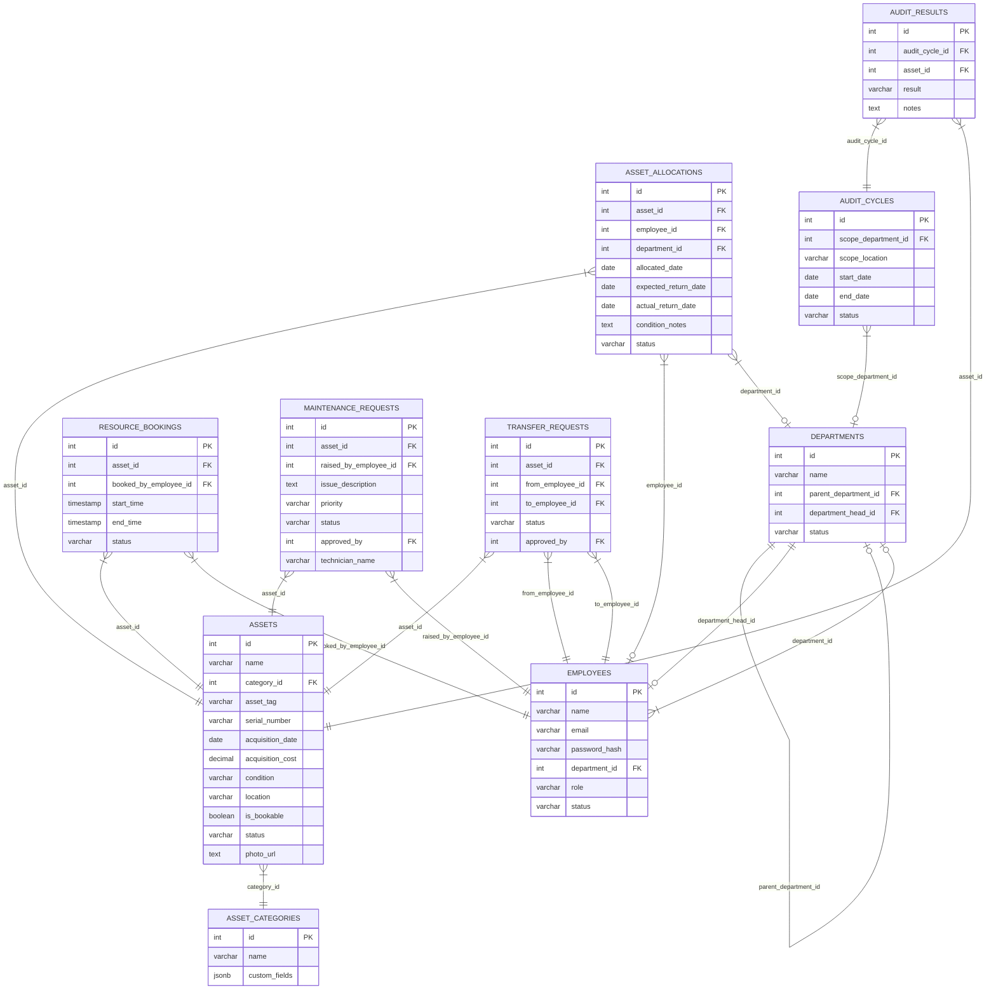

# AssetFlow — Enterprise Asset & Resource Management ERP

AssetFlow is a high-fidelity Enterprise Asset & Resource Management ERP system built from scratch for the Odoo Hiring Hackathon. It enables organizations to register, track, allocate, book, audit, and maintain physical assets and shared resources under a unified, role-based system.

---

## 🚀 Quick Start & Installation

### Prerequisites
- [Node.js](https://nodejs.org/) (v18 or higher)
- [NPM](https://www.npmjs.com/) (v9 or higher)
- A local PostgreSQL database (A portable version is already installed in this project directory).

---

### Step 1: Start the Database Server

The project contains a pre-configured portable PostgreSQL database. 

1. From the project root (`AssetFlow`), launch the database server process:
   ```powershell
   ./pgsql/bin/postgres.exe -D ./pg_data
   ```
2. In a separate terminal session, verify the server is running by creating the database:
   ```powershell
   ./pgsql/bin/createdb.exe -U postgres -h 127.0.0.1 assetflow
   ```

---

### Step 2: Set Up the Backend Server

1. Open a new terminal in the `/backend` folder:
   ```bash
   cd backend
   ```
2. Install npm packages:
   ```bash
   npm install
   ```
3. Run database migrations to build tables, constraints, enums, and indexes:
   ```bash
   npm run migrate:latest
   ```
4. Run database seeds to populate initial departments, asset categories, and demo employee accounts:
   ```bash
   npm run seed:run
   ```
5. Start the backend REST API in development mode (listens on `http://localhost:3000`):
   ```bash
   npm run dev
   ```

---

### Step 3: Set Up the Frontend Interface

1. Open a new terminal in the `/frontend` folder:
   ```bash
   cd frontend
   ```
2. Install npm packages:
   ```bash
   npm install
   ```
3. Launch the Vite dev server (runs on `http://localhost:5173`):
   ```bash
   npm run dev
   ```
4. Open your browser and navigate to `http://localhost:5173`.

---

## 🔑 Demo Login Credentials

The login screen contains **quick-fill buttons** at the bottom to easily switch between demo roles:

| Role | Username (Email) | Password | Scoped Permissions |
| :--- | :--- | :--- | :--- |
| **Admin** | `admin@assetflow.com` | `AssetFlowSecure2026!` | Departments hierarchy, role promotions, audit scheduling, analytics |
| **Asset Manager** | `manager@assetflow.com` | `AssetFlowSecure2026!` | Registering assets, issuing allocations, approving transfers, technician logs |
| **Department Head** | `head@assetflow.com` | `AssetFlowSecure2026!` | Book resources, approve department requests, view department custody |
| **Employee** | `employee@assetflow.com` | `AssetFlowSecure2026!` | View own allocated assets, request booking, raise maintenance, start transfer |

---

## 🛠️ Technical Stack & Architecture Justification

### 1. Database: PostgreSQL (Relational)
- **Justification:** Enterprise ERPs demand strict transactional safety (ACID). NoSQL solutions (MongoDB) risk double-allocations or booking collisions. We use PostgreSQL to enforce relational integrity, constraints (check rules), enums, and indexes on queried fields (`asset_tag`, `status`, `department_id`).
- **Concurrency Lock:** During critical actions (allocating an asset or booking a room), the backend executes a row-level lock (`SELECT ... FOR UPDATE`). This serializes competing requests, eliminating double-allocation race conditions.

### 2. Backend: Custom REST API (Node.js/Express in TypeScript)
- **Justification:** Express provides a lightweight, modular foundation. By using TypeScript, we share data models and interfaces between the frontend and backend, reducing data validation mismatch bugs.
- **Data Validation:** Zod schema validation blocks run as middleware, validating incoming request shapes and ensuring specific, user-friendly API error responses (e.g., "Expected return date cannot be in the past").

### 3. Frontend: React / Vite (TypeScript + Vanilla CSS)
- **Justification:** Vite handles hot reloading and build compilation.
- **Styling:** Engineered with **Vanilla CSS** to avoid external dependencies. It uses custom HSL variables to support a sleek glassmorphic dark theme, with responsive grids for mobile/tablet warehouse use.

---

## 📊 Database Schema Layout

The relational database is fully normalized:



---

## 🏛️ Odoo Evaluation Criteria Compliance

### 1. Database Design & Integrity
- **Third-Normal Form (3NF):** Every entity represents a single logical element. No redundant data is stored.
- **Constraints & Enums:** Defined enums for roles, statuses, priorities, conditions, and audit results. Validates that allocations are assigned to *either* an employee or a department, but never both.
- **Cascading Rules:** Foreign keys use `ON DELETE RESTRICT` for inventory-linked items to prevent orphan assets, and `ON DELETE CASCADE` for temporary structures (audit results/assignments).

### 2. Backend Security & Role Enforcement (RBAC)
- **Real-Time Middleware:** Route calls check JWT authenticity and verify the employee's role against the endpoint's allowed list.
- **Promotion Safety:** Prevents self-elevation. Only Admins can modify employee roles, and only from the employee directory screen. Users cannot promote or demote their own accounts.

### 3. Modularity & Code Quality
- **Separation of Concerns:** Defined clean controller routing in Express. The directory layout separates route definitions, config files, migrations, seeds, and middleware blocks, avoiding messy code bundling.
- **Shared Types:** TypeScript models unify the database records, request schemas, and frontend hooks, preventing runtime schema mismatches.

### 4. Scalability & Transaction Concurrency
- **Indexing:** Indexes are created on frequently searched columns (`asset_tag`, `status`, `department_id`, `location`, `start_time/end_time`), optimizing complex report query performance.
- **Concurrency Locks:** Uses database-level locks (`SELECT ... FOR UPDATE`) during asset allocation or resource reservation. This ensures that concurrent users trying to allocate the same asset are serialized, guaranteeing zero double-allocations or booking collisions.

### 5. UI/UX Usability
- **Curated Theme:** Modern glassmorphic style featuring a custom color palette, smooth transitions, and glowing status labels.
- **Responsive Layout:** Grid layouts adapt dynamically to tablet widths, allowing staff on warehouse floors or factories to register and audit assets on the go.
- **Dynamic Feedback:** Handles loader spinners, success/error toasts, and custom inline alerts, maintaining an interactive user interface.
